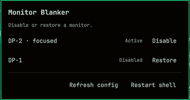

# Monitor Blanker

An Omarchy bar widget for disabling and restoring individual monitors while gaming.

Click the bar icon to open a compact dropdown listing every active or disabled
monitor. Each row shows the EDID display name, connector, focused state,
resolution, refresh rate, rotation, and the appropriate **Disable** or
**Restore** action.



## Features

- **Per-monitor controls** — Disable one output without touching the others.
- **State-aware actions** — Active monitors show **Disable**; disabled monitors show **Restore**.
- **Friendly display identity** — Shows the monitor make/model with its connector, such as `Samsung Odyssey G81SF (DP-1) — Focused`.
- **Rotation control** — Apply 0°, 90°, 180°, or 270° per monitor.
- **Saved arrangement** — Edit monitor X/Y positions and save them to `~/.config/omarchy-monitor-blanker/monitors.json`.
- **Re-apply control** — Reload Hyprland and re-apply the saved arrangement when a display returns in a bad state.
- **Layout-safe restore** — Reloads your canonical Lua monitor configuration so explicit positions, modes, scales, and transforms return correctly.
- **Omarchy-native UI** — Uses a theme-aware bar widget and dropdown panel.

## Requirements

- Omarchy Quattro with Omarchy Shell.
- Hyprland 0.55 or newer is recommended because the plugin uses `hyprctl eval` and `hl.monitor(...)`.
- No external packages, DDC/CI access, or elevated privileges are required.

## Install

```sh
omarchy plugin add https://github.com/thetxeagle/omarchy-monitor-blanker.git --enable
```

Click the monitor icon in the bar, then use the monitor rows and Arrangement
section. Saving an arrangement stores a small JSON file in your user config;
the plugin re-applies it when the widget starts and when **Re-apply config** is
toggled.

## Important behavior

Disabling a monitor removes it from Hyprland's layout, so windows and workspaces
may move to another active output. Restore reloads your user's
`~/.config/hypr/monitors.lua`, then reapplies the saved plugin arrangement.
Keep `monitors.lua` as the source of truth for modes and scales; the plugin
stores only positions and transforms.

Plugins run as unsandboxed code inside `omarchy-shell`. Review the source before
installing or enabling it.

## Configure placement

```sh
omarchy bar move io.github.omarchy.monitor-blanker --section right
```

## Validate locally

```sh
omarchy plugin validate .
bash -n monitor-blanker
```

## Uninstall

```sh
omarchy plugin remove io.github.omarchy.monitor-blanker
```

## License

MIT. See [LICENSE](LICENSE).
